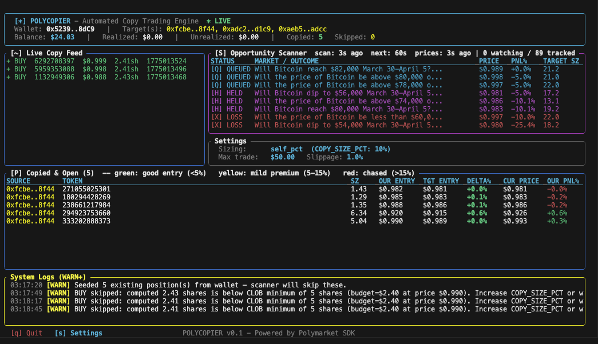

# polycopier



A high-performance, terminal-based copy trading bot for Polymarket prediction markets,
built in Rust against the official [`polymarket-client-sdk`](https://github.com/Polymarket/rs-clob-client).

[](LICENSE)
[](https://www.rust-lang.org)
[](#disclaimer)
[](https://github.com/cbaezp/polycopier/actions/workflows/ci.yml)
[](https://github.com/cbaezp/polycopier/releases)

> **Experimental Software.**
> This project is in active development and has not been audited for production use.
> It executes real trades on your behalf. Run it only with capital you can afford to lose,
> keep `MAX_TRADE_SIZE_USD` low while testing, and review all risk parameters before
> increasing position sizes. See the [Disclaimer](#disclaimer) section for full details.

---

## Overview

polycopier monitors one or more target wallets on Polymarket and automatically mirrors
their trades into your own account in real time.

**Two independent signal sources feed the same execution engine:**

1. **Real-time listener** - polls the Data API every 2 seconds and copies new fills the
   moment they appear, using transaction-hash deduplication to handle burst activity.

2. **Adaptive position scanner** - scans the target's full open-position portfolio and
   evaluates catch-up entries (positions the target had open before the bot started).
   Scan frequency adapts dynamically between 10 and 60 seconds based on how close each
   target position's current price is to their original entry - scanning most aggressively
   when a catch-up entry is still at a favorable price.

**Trade intent classification** — every event is verified against:
1. The **copy ledger** (`copy_ledger.json`) — a persistent record of which target we copied each token from.
2. A **live Polymarket API call** at decision time — our wallet and the target wallet are both queried in parallel (5 s timeout, falls back to scanner cache if the API is slow).

This gives the engine authoritative, race-proof answers:

| Live: we hold? | Live: target holds? | Ledger entry? | Event | Decision |
|---|---|---|---|---|
| No | No | None | BUY | **Copy** — fresh long entry |
| No | Yes | None | BUY | **Copy** — fresh long entry |
| Yes | Any | token X from A | BUY | **Skip** — one-position-per-token rule |
| Yes | No | None | BUY | **Skip** — target closing short we never entered |
| Yes | Any | token X from **A** | SELL from **A** | **Close** — correct source |
| Yes | Any | token X from **A** | SELL from **B** | **Skip** — irrelevant; hold for A |
| Yes | Any | None (orphan) | SELL | **Defensive close** — ledger lost, close to be safe |
| No | Any | open entry | SELL | **Skip + sync ledger** — position already closed while bot was down |
| No | Yes | None | SELL | **Skip** — closing long we never entered |
| No | No | None | SELL | **Skip** — target opening short (not supported) |

The bot **never enters the same token from two different targets.** The first target to enter
a token "owns" it in the ledger; all subsequent entries for that token from other targets
are ignored until the position is fully closed.

The bot provides two powerful interfaces:
1. **Web Dashboard** - A sleek, modern React frontend hosted natively at `http://localhost:3000` for live monitoring, position tracking (including exact source wallets), and interactive hot-swappable configuration.
2. **Terminal UI (TUI)** - A lightweight, six-panel `ratatui` interface directly in your console.

The bot can also run **headless** (no TUI) as a systemd daemon on a Linux server.

---

## Features

- **Real-time trade copying** - polls the Polymarket Data API every 2 seconds with a
  rate limit of 20 fills per cycle. Deduplicates by transaction hash (not timestamp) so
  burst activity is never silently dropped.

- **Adaptive open-position scanner** - catches positions the target opened before the bot
  started. Scan interval scales from 10s (target position still at entry price) to 60s
  (price has moved significantly or no enterable positions exist). Catch-up orders are priced
  at the **target's average entry price** (not the current market price), so you pay what
  the target paid — not whatever the market is at when the scanner fires.

- **Intent classification** - every incoming BUY and SELL is checked against the target's
  last-known positions to determine true intent (fresh entry, adding to long, closing long,
  closing short). Short entries and short closures by the target are correctly skipped.

- **SELL execution guards**:
  - 97% collateral buffer applied to all SELL sizes to satisfy the CLOB's fee reserve requirement.
  - SELL quantities are based on **our own held size**, not the target's order size.
  - SELL is never submitted for a token we don't hold.

- **BUY floor** - entry size targets a minimum of $1.10 notional to prevent rounding errors
  from dropping below the CLOB's $1.00 minimum order size.

- **Interactive setup wizard** - prompts for all credentials on first run and saves to `.env`.

- **Live balance tracking** - CLOB balance polled every 10 seconds.

- **Three-mode proportional sizing** - choose how each trade is sized:

  | Mode | Formula | When to use |
  |---|---|---|
  | `self_pct` (default) | `our_balance * COPY_SIZE_PCT` | Fixed % of our balance per trade — consistent and predictable |
  | `target_usd` | `target_size * target_price` | Mirror the target's exact dollar bet |
  | `fixed` | Always `MAX_TRADE_SIZE_USD` | Simple deterministic size |

  All modes enforce a $5.00 CLOB minimum and `MAX_TRADE_SIZE_USD` ceiling.

- **Risk engine** — multi-layer defence applied to every trade event:
  - **Micro-trade filter** — rejects orders with < $1.00 notional (anti-spoofing)
  - **Size cap** — `MAX_TRADE_SIZE_USD` ceiling on every trade
  - **Daily volume limit** — `MAX_DAILY_VOLUME_USD` (0 = disabled); counts both BUY and SELL side; resets at UTC midnight
  - **Consecutive-loss circuit breaker** — `MAX_CONSECUTIVE_LOSSES` (0 = disabled); pauses trading for `LOSS_COOLDOWN_SECS` after N consecutive losses
  - **Rapid-flip guard** — 60-second cooldown per token prevents the bot from immediately re-entering a position it just exited
  - **Scanner guards** applied only to catch-up (scanner) entries:
    - `MAX_COPY_LOSS_PCT` — skip if target is already this far underwater
    - `MAX_COPY_GAIN_PCT` — skip if target is already this far in profit (chasing adds slippage)
    - **Expiry guard** — skip if `redeemable=true` (market resolved on-chain) or `end_date` is strictly in the past (`< today`). Same-day markets are **not** blocked — `redeemable` is the authoritative settlement signal; `end_date < today` is only a backstop for stale API data

- **Web Dashboard** - a pristine glassmorphism React application hosted at `http://localhost:3000`:
  - Account overview (total balance, PnL, target tracker)
  - Beautiful **Copied & Open** positions table featuring exactly which **Source Wallet** initiated the trace.
  - Interactive **Config Settings Panel** with intuitive range sliders, dynamic system toggles, and one-click Seamless Hot Rebooting.

- **Terminal UI** - six-panel ratatui interface:
  - Account dashboard (balance, PnL, **API-sourced Copied counter**)
  - Live copy feed (pass/fail, skip reason per event)
  - **Copied & Open positions table** (only positions confirmed open in both our wallet
    and a target wallet; shows SOURCE WALLET, entry quality, OUR_PNL%)
  - Opportunity scanner table (color-coded by status, live refresh timing):

    | Status | Meaning |
    |---|---|
    | `[W] WATCH` | Valid candidate — will be entered next cycle |
    | `[Q] QUEUED` | Order already submitted this session |
    | `[H] HELD` | We already own this token |
    | `[X] LOSS` | Target too far underwater (`MAX_COPY_LOSS_PCT`) |
    | `[^] GAIN` | Target already too far in profit (`MAX_COPY_GAIN_PCT`) |
    | `[-] RANGE` | Current price outside `MIN/MAX_ENTRY_PRICE` |
    | `[E] EXPRD` | Market resolved or past end date — never entered |
  - **Settings panel** (live config summary, `[s]` to open wizard)
  - **System Logs panel** (WARN+ captured in-memory, never corrupts the TUI)

- **Entry quality analysis** - the Copied & Open table shows per-row entry comparison:

  | Column | Description |
  |---|---|
  | SOURCE | Target wallet the position was copied from (shortened) |
  | TOKEN | First 12 chars of the token ID |
  | OUR ENTRY | Our average entry price |
  | TGT ENTRY | Target's average entry price |
  | DELTA% | `(our_entry - tgt_entry) / tgt_entry`: how much more we paid |
  | CUR PRICE | Current market price (refreshed independently every 20s) |
  | OUR PNL% | `(cur_price - our_entry) / our_entry`: our estimated P&L |

  Row color codes: green (DELTA <= +5%), yellow (+5-15%), red (>+15% -- chased).

- **Live refresh timing** - scanner panel header shows:
  `scan: 12s ago  next: 48s  prices: 7s ago`
  so you can always see exactly when each data source last refreshed.

- **Independent price refresh task** - `CUR PRICE` and `OUR_PNL%` are refreshed
  every 20 seconds regardless of scanner urgency. The scanner's adaptive interval
  can reach 60s when all positions are deeply in-the-money, but prices in the
  Copied table stay at most 20s stale via a dedicated background fetch.

- **In-TUI settings editor** - press `[s]` to switch to a full-screen settings editor
  without leaving the TUI. All current values are shown pre-filled in a table; use arrow
  keys to navigate, `Enter` to edit a field, `[s]` to save the new `.env` and restart
  the bot cleanly via `execv()`, or `[q]` to go back without saving.

- **API-accurate Copied counter** - a dedicated background task queries your wallet
  and each target wallet directly via the API every 30 seconds and computes the
  intersection. Never based on session state or scanner timing.

- **Pre-commit quality gates** - `cargo fmt`, `cargo clippy -D warnings`, and `cargo test`
  run automatically before every commit via `.githooks/pre-commit`.

---

## Requirements

- Rust 1.78 or later (`rustup update stable`)
- A Polymarket account with a funded proxy wallet
- Your wallet's private key (for signing orders)

> **Warning:** Never commit your private key or `.env` file to version control.
> The provided `.gitignore` excludes `.env` by default.

---

## Installation

```bash
git clone https://github.com/cbaezp/polycopier
cd polycopier
# Enable the pre-commit quality gate
git config core.hooksPath .githooks
cargo build --release
```

The compiled binary will be at `target/release/polycopier`.

---

## Configuration

polycopier uses a **two-file configuration design** for security and maintainability:

| File             | Contents                                       | Version-controlled? |
|------------------|------------------------------------------------|---------------------|
| `.env`           | Secrets: `PRIVATE_KEY`, `FUNDER_ADDRESS`, `TARGET_WALLETS` | **No** (in `.gitignore`) |
| `config.toml`    | All tunables (risk, sizing, scanner, etc.)     | **Yes** (no secrets) |

```bash
# First run: copy the examples and fill in your secrets
cp .env.example .env
cp config.example.toml config.toml  # optional — bot auto-generates on startup
# Edit .env with your private key and wallet addresses
cargo run --release
```

On first run, if `config.toml` is missing the bot auto-generates it from defaults
(or migrates any legacy tunable values still present in `.env`).

### `.env` — Secrets only

| Variable          | Required | Description |
|-------------------|----------|-------------|
| `PRIVATE_KEY`     | **Yes**  | Hex private key for the signing wallet (`0x...` or plain hex) |
| `FUNDER_ADDRESS`  | **Yes**  | Proxy/Safe wallet address that holds USDC (shown on Polymarket profile) |
| `TARGET_WALLETS`  | **Yes**  | Comma-separated list of target proxy wallet addresses to copy |

### `config.toml` — Tunables

#### `[execution]`

| Key | Default | Description |
|---|---|---|
| `max_slippage_pct` | `0.02` | Slippage buffer added to the target's avg entry price for limit orders (2% = `0.02`) |
| `max_trade_size_usd` | `10.00` | Maximum USDC to spend per copied trade (hard ceiling for all sizing modes) |
| `max_delay_seconds` | `10` | Discard live trade events older than this many seconds (staleness filter) |
| `sell_fee_buffer` | `0.97` | `sell_size = held × buffer` — absorbs ~3% CLOB fee. Default `0.97` |

#### `[sizing]`

| Key | Default | Description |
|---|---|---|
| `mode` | `"self_pct"` | Sizing strategy: `"self_pct"`, `"target_usd"`, or `"fixed"` |
| `copy_size_pct` | `0.15` | Fraction of our balance per trade when `mode = "self_pct"` (e.g. `0.15` = 15%) |

| Mode | Formula | When to use |
|---|---|---|
| `self_pct` (default) | `balance × copy_size_pct` | Fixed % of your balance — scales naturally with account size |
| `target_usd` | `target_size × target_price` | Mirror the target's exact dollar notional |
| `fixed` | Always `max_trade_size_usd` | Simple deterministic size |

#### `[scanner]`

| Key | Default | Description |
|---|---|---|
| `max_copy_loss_pct` | `0.40` | Skip catch-up if target is already this far underwater (40% = `0.40`) |
| `max_copy_gain_pct` | `0.05` | Skip catch-up if target is already this far in profit (5% = `0.05`) |
| `min_entry_price` | `0.02` | Minimum token price for catch-up entries (filters near-zero dust) |
| `max_entry_price` | `0.999` | Maximum token price for catch-up entries |
| `max_entries_per_cycle` | `1` | Max positions queued per scan cycle. Raise to 2–3 to enter multiple opportunities simultaneously |

#### `[risk]`

| Key | Default | Description |
|---|---|---|
| `max_daily_volume_usd` | `0` | Total USD the bot may trade per UTC day (BUY + SELL). `0` = disabled |
| `max_consecutive_losses` | `0` | Consecutive losses before triggering a cooldown pause. `0` = disabled |
| `loss_cooldown_secs` | `300` | Seconds to pause after hitting `max_consecutive_losses` |

#### `[ledger]`

| Key | Default | Description |
|---|---|---|
| `retention_days` | `90` | Days to keep closed trade entries before pruning on startup. `0` = never prune |

### Wallet Type

The SDK supports three signature types. Set the one matching your Polymarket account:

| Account Type | Signature Type in code |
|---|---|
| MetaMask / hardware wallet (EOA) | `SignatureType::Eoa` |
| Magic / email wallet | `SignatureType::Proxy` (current default) |
| Browser wallet via Gnosis Safe | `SignatureType::GnosisSafe` |

Edit `src/clients.rs` and change `SignatureType::Proxy` to match your setup.

---

## Usage

### Running Locally

You can launch the bot in three distinct modes depending on how you prefer to configure and monitor it:

**1. Standard Terminal Mode (Local Console)**
```bash
cargo run --release
```
1. **The Terminal UI:** Rendered directly in your active console window where you ran the command. (The Web Dashboard is deliberately disabled to reduce background footprint).

**2. Web UI-Only Mode (Recommended for new users)**
```bash
cargo run --release -- --ui
```
This skips the terminal interface entirely. It natively launches the Web Dashboard and automatically opens `http://localhost:3000` in your browser.
If you run this without an `.env` file, it will seamlessly suspend the bot and present a **Web Setup Wizard** where you can securely input your credentials. Once submitted, the bot will hot-reboot itself flawlessly.

**3. Headless Daemon Mode (For Servers & PM2)**
```bash
cargo run --release -- --daemon
```
Runs the bot entirely in the background, logging strictly to stdout. The terminal interface and the Web Dashboard are both discarded, ensuring a completely headless and silent 24/7 worker.

After saving your initial `.env` file via either the terminal or the Web Wizard, `config.toml` is auto-generated using safe defaults.

**Modifying Settings:**
- **From the Web Dashboard:** Click the "Settings" tab in the browser to visually adjust all 15 operational tunables in real-time.
- **From the TUI:** Press **`[s]`** inside the terminal to open the native settings editor where values are editable with arrow keys and saved to `config.toml` on `[s]`.

### Logging

WARN+ messages are captured in the **System Logs** panel inside the TUI.
No log lines are printed to the terminal while the TUI is active.
To see verbose diagnostic output in a non-TUI context:

```bash
RUST_LOG=debug cargo run --release
```

### Keyboard Controls

| Key | Action |
|---|---|
| `q` | Quit |
| `s` | Open in-TUI settings editor (navigate with arrows, Enter to edit, `[s]` to save & restart, `[q]` to go back) |

---

## Server Deployment (24/7 headless mode)

The bot ships with a `--headless` flag so it can run as a Linux daemon with
no terminal required. All background tasks (listener, scanner, strategy engine,
price refresh, balance poller, copied counter) run identically — it just skips
the ratatui TUI.

### Modes at a glance

| Command | Mode | When to use |
|---|---|---|
| `polycopier` | Pure Terminal UI | Local monitoring on your machine (Lowest memory footprint) |
| `polycopier --ui` | Web UI + Headless | Local browser interface on `:3000` |
| `polycopier --headless` | Pure Headless Worker | Cloud deployment (24/7 logging, TUI discarded, no open ports) |

### Prerequisites

- A Linux server with `systemd` (Ubuntu, Debian, etc.)
- A `.env` file with all settings already configured

> **Tip:** The easiest way to get a valid `.env` is to run the bot once locally
> (`cargo run --release`), complete the setup wizard, then `scp` the resulting
> `.env` to your server alongside the binary.

### Quick start

```bash
# 1. Build a static Linux binary on your Mac (requires the musl target)
rustup target add x86_64-unknown-linux-musl
cargo build --release --target x86_64-unknown-linux-musl

# 2. Copy binary + deploy files + your configured .env and config.toml to the server
scp target/x86_64-unknown-linux-musl/release/polycopier  user@server:/tmp/
scp deploy/polycopier.service deploy/install.sh           user@server:/tmp/deploy/
scp .env config.toml                                      user@server:/tmp/

# 3. On the server: install (creates system user, registers service)
sudo /tmp/deploy/install.sh /tmp/polycopier

# 4. Copy your pre-configured .env and config.toml into place
sudo cp /tmp/.env /opt/polycopier/.env
sudo cp /tmp/config.toml /opt/polycopier/config.toml
sudo chown polycopier:polycopier /opt/polycopier/.env /opt/polycopier/config.toml
sudo chmod 600 /opt/polycopier/.env  # secrets
sudo chmod 644 /opt/polycopier/config.toml  # tunables -- no secrets

# 5. Start the daemon
sudo systemctl start polycopier

# 6. Tail live logs (INFO+ in headless mode)
sudo journalctl -u polycopier -f
```

### Alternatively: first-time config on the server

If you prefer to generate the `.env` directly on the server:

```bash
# Run once interactively to complete the wizard (writes /opt/polycopier/.env)
sudo -u polycopier /opt/polycopier/polycopier
# Ctrl-C after the wizard finishes, then:
sudo systemctl start polycopier
```

### systemd management cheatsheet

```bash
sudo systemctl status polycopier           # check status
sudo systemctl stop polycopier             # graceful stop (30s timeout)
sudo systemctl restart polycopier          # restart
sudo journalctl -u polycopier -f           # tail logs live
sudo journalctl -u polycopier --since today  # today's logs only
```

### Updating the binary

```bash
# Build new binary locally
cargo build --release --target x86_64-unknown-linux-musl

# Deploy
scp target/x86_64-unknown-linux-musl/release/polycopier user@server:/tmp/polycopier
ssh user@server 'sudo systemctl stop polycopier && \
  sudo cp /tmp/polycopier /opt/polycopier/polycopier && \
  sudo systemctl start polycopier'
```

### Changing settings on the server

**Option A** — Edit `.env` directly and restart:
```bash
sudo nano /opt/polycopier/.env
sudo systemctl restart polycopier
```

**Option B** — Update locally via the TUI settings editor (`[s]`), then `scp`
the updated `.env` to the server and `systemctl restart`.

### Daemon characteristics

| Feature | Detail |
|---|---|
| **Auto-restart on crash** | `Restart=on-failure`, 10 s delay |
| **Auto-start on boot** | Enabled by `install.sh` |
| **Graceful shutdown** | 30 s window on SIGTERM for in-flight orders |
| **Logs** | `journalctl -u polycopier` (INFO+ from stdout) |
| **Security** | Dedicated `polycopier` system user, `NoNewPrivileges`, `ProtectSystem=strict` |
| **Settings write** | `/opt/polycopier` is `ReadWritePaths` so `.env` can be updated at runtime |

---

## Architecture

```
main.rs
  |
  +-- config.rs           Load .env / interactive wizard
  |
  +-- clients.rs          CLOB authentication + order submission + balance fetcher
  |
  +-- listener.rs         Data API polling loop (2s, hash-dedup) -> TradeEvent channel
  |
  +-- position_scanner.rs Catch-up scanner (adaptive 10-60s) -> TradeEvent channel
  |                        Updates target_positions (all fields) on each cycle.
  |
  +-- copied_counter.rs   API-based Copied counter (our wallet x target wallets, 30s)
  |
  +-- copy_ledger.rs      Persistent copy ledger (copy_ledger.json):
  |                        - records which target wallet each position was copied from
  |                        - enforces one-position-per-token rule
  |                        - survives restarts; reconciled against live wallet on boot
  |
  +-- strategy.rs         Receives TradeEvents, queries live API + ledger for intent,
  |                        applies risk checks, submits orders via OrderSubmitter
  |
  +-- risk.rs             RiskEngine: micro-trade filter, daily volume cap,
  |                        consecutive-loss circuit breaker, rapid-flip guard (60s per token)
  |
  +-- state.rs            Shared BotState (Arc<RwLock<_>>): balance, our positions,
  |                        target positions, live feed, TUI counters, refresh timestamps
  |
  +-- ui.rs               ratatui TUI: dashboard, live feed, Copied & Open positions,
  |                        scanner (with live refresh timing), in-TUI settings editor,
  |                        system logs
  |
  +-- log_capture.rs      TuiLogLayer: captures WARN+ to in-memory ring buffer
  |
  +-- models.rs           Core types: TradeEvent, EvaluatedTrade, TargetPosition
  |                        (including source_wallet), ScanStatus, SizingMode
  +-- backoff.rs          Exponential backoff helper (used by listener, scanner, wallet_sync)
  +-- utils.rs            Timestamp formatting helpers
  |
  +-- deploy/
        polycopier.service  systemd unit (Restart=on-failure, journal logging,
                            30s stop timeout, security hardening)
        install.sh          One-shot installer (system user, binary, service enable)
```

### Data Flow

```
Polymarket Data API
    |
    +-- listener (2s poll, limit 20, hash-dedup) ------> mpsc::Sender<TradeEvent>
    |                                                              |
    +-- position_scanner (adaptive 10-60s poll) ------> mpsc::Sender<TradeEvent> (cloned)
    |   Writes: target_positions (all fields, including cur_price)
    |   Writes: last_scan_at, next_scan_secs
    |                                                    strategy engine
    +-- price_refresh (20s, independent of scanner) -----> patches cur_price in
    |   Writes: last_price_refresh_at                    target_positions only
    |                                                              |
    +-- copied_counter (30s)                                      |
    |   Writes: copied_count (our positions x target positions)   |
    |                                                    wallet filter
    +-- balance_poll (10s)                               intent classification
        Writes: total_balance                            risk check (notional, size)
                                                         SELL guard
                                                                   |
                                                         CLOB API  (order submission)
```

### Data freshness

| Data | Refresh interval | Background task |
|---|---|---|
| Live trade events | 2s | listener |
| USDC balance | 10s | balance poll |
| Prices in Copied table (CUR PRICE, OUR PNL%) | 20s | price refresh |
| Copied count (header) | 30s | copied_counter |
| Full target portfolio (scanner table, entry classification) | 10-60s adaptive | position_scanner |
| **Live position verification (our wallet + target wallet)** | **per trade event** | **strategy engine** |
| TUI render | 250ms | event loop |


---

## Opportunity Scanner Logic

The scanner fetches the target's full open portfolio and evaluates each position in order.
A position is skipped at the first failing guard:

1. **Resolved / expired** — `redeemable=true` (market settled on-chain) or `end_date` is strictly before today (`end_date < today`). Same-day markets (`end_date == today`) are **not** blocked when `redeemable=false` — they are still open and accepting orders. Resolution state comes from the `redeemable` flag, not the date.
2. **Already held** — the bot already holds this token (`SkippedOwned`)
3. **Already queued** — an entry order was sent this session (`Entered`)
4. **Price range** — current price must be between `MIN_ENTRY_PRICE` and `MAX_ENTRY_PRICE` (`SkippedPrice`)
5. **Loss threshold** — the target's unrealized loss must be less than `MAX_COPY_LOSS_PCT` (`SkippedLoss`)
6. **Gain threshold** — the target's unrealized gain must be less than `MAX_COPY_GAIN_PCT` (`SkippedGain`)

Positions passing all guards are classified as `Monitoring` (green in TUI) and up to `SCAN_MAX_ENTRIES_PER_CYCLE` entries are queued per cycle (default 1).

### Catch-up Intervals

The scanner reschedules itself after each cycle based on the best available opportunity:

| Target position state | Scan interval |
|---|---|
| Price exactly at target's entry (0% PnL) | 10s |
| Small move (+/-5%) | ~27s |
| Moderate move (+/-10%) | ~43s |
| Large move (+/-15%+) - would be chasing | 60s |
| No enterable (Monitoring) positions | 60s |
| Position past `MAX_COPY_LOSS_PCT` | 60s (filtered out) |

---

## Development

```bash
# Run with live reloading (requires cargo-watch)
cargo watch -x run

# Run the full test suite (267 tests, no network required)
cargo test --all

# Run only the copy ledger tests
cargo test --test copy_ledger_tests

# Run the live API test (requires internet)
cargo test --test integration live_holds_query_reaches_api -- --ignored

# Lint
cargo clippy --all-targets -- -D warnings

# Format
cargo fmt
```

### Test layout

| File | What it covers |
|---|---|
| `tests/copy_ledger_tests.rs` | `CopyLedger` — CRUD, source-wallet specificity, reconcile, disk round-trip, in-memory mode, atomic write, partial fill tracking, pruning, sweep source-wallet lookup |
| `tests/integration.rs` | Strategy engine: intent classification, one-position-per-token, SELL gating, risk guards, slippage, deduplication; scanner sort, sell fee buffer, scan_max_entries, unrealized PnL |
| `tests/backoff_tests.rs` | `next_backoff` — base interval, doubling, cap, overflow safety |
| `tests/listener_tests.rs` | Dedup ring-buffer eviction; `try_send` backpressure semantics |
| `tests/risk_tests.rs` | `RiskEngine` — daily volume limit, consecutive-loss circuit breaker, rapid-flip guard, anti-spoofing |
| `tests/order_watcher_tests.rs` | Cancel-decision predicate; wallet_sync position upsert/remove rules; expiry alignment (`< today` for scanner and watcher) |
| `tests/sizing_tests.rs` | `compute_order_usd` for all four sizing modes + floor/cap guards |
| `tests/copied_counter_tests.rs` | `count_intersection` pure function: empty, full, partial, no overlap, multi-target |
| `src/ui.rs` (`settings_tests`) | In-TUI settings editor: field change detection, key navigation, edit lifecycle, `.env` output |

The pre-commit hook runs fmt + clippy + tests automatically. To install it:

```bash
git config core.hooksPath .githooks
```

---

## Security Notes

- Your private key is used locally to sign EIP-712 order hashes. It is never transmitted
  to any server - only the resulting signature is sent to the CLOB API.
- The `.env` file is excluded from version control by `.gitignore`. Treat it like a password.
- Review `src/risk.rs` and configure appropriate limits before running with significant capital.
- This software is provided as-is. You are solely responsible for any trades it executes.

---

## Releases

Releases are created automatically by GitHub Actions.

**On every merge to `main`:** the release workflow auto-bumps the patch version of the
latest semver tag (e.g. `v0.1.0` -> `v0.1.1`), creates an annotated tag, builds
binaries for macOS (Apple Silicon), macOS (Intel), and Linux, and publishes a
GitHub Release with the artifacts attached.

The workflow avoids the double-trigger problem: after the `version` job pushes an
auto-generated tag, the tag-triggered re-run recognizes it was started by
`github-actions[bot]` and skips its own `build` and `release` jobs, leaving only
the original branch-triggered run to complete.

**Manual release:** push any `v*` tag directly:

```bash
git tag v0.2.0
git push origin v0.2.0
```

Pre-release versions (e.g. `v0.2.0-beta`) are automatically marked as pre-release on GitHub.

---

## Disclaimer

This software is **experimental and provided for educational purposes only.**

- It has not been audited and may contain bugs that result in unintended order execution.
- Prediction market trading carries significant financial risk. Positions can go to zero.
- Past performance of any copied wallet is not indicative of future results.
- The authors take no responsibility for financial losses incurred through use of this software.
- You are solely responsible for reviewing the risk parameters, monitoring the bot while it runs,
  and ensuring compliance with the terms of service of Polymarket and applicable laws in
  your jurisdiction.

Start with the minimum `MAX_TRADE_SIZE_USD` and verify each order in your Polymarket
dashboard before increasing capital exposure.

---

## License

MIT. See [LICENSE](LICENSE).
